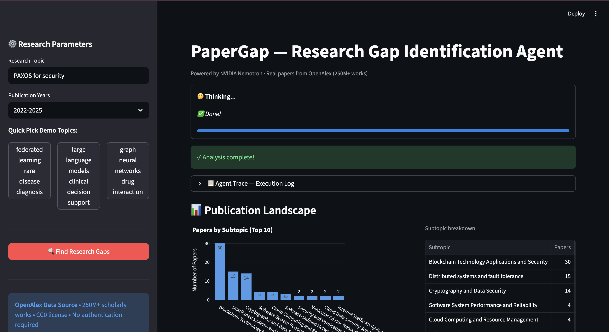
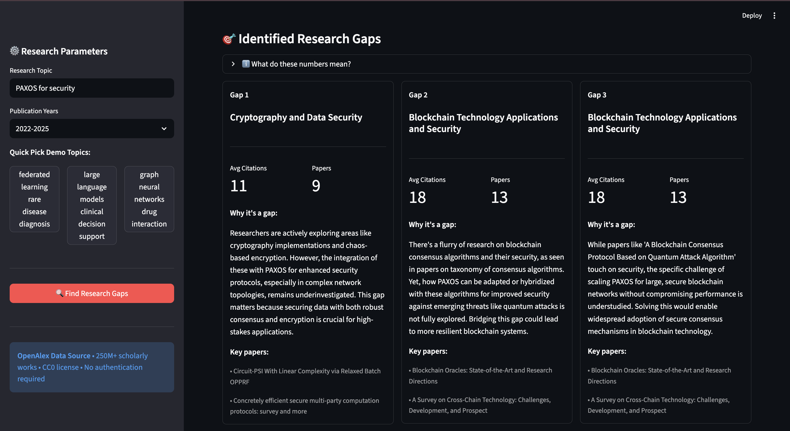
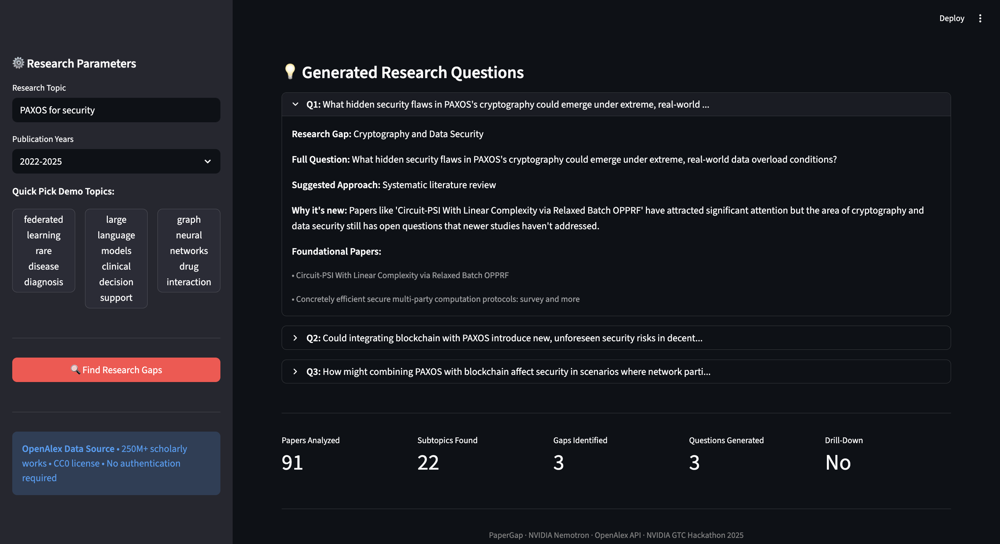

# PaperGap — Research Gap Identification Agent


> Developed collaboratively for the **NVIDIA GTC Agents for Impact Hackathon 2026** · Powered by NVIDIA Nemotron

PaperGap is an AI agent that takes any research topic, fetches real academic papers, clusters them semantically, and uses NVIDIA's Nemotron LLM to surface **underexplored research gaps** and generate **concrete, novel research questions** — in plain English.

---

## Screenshots


*Publication landscape: papers by subtopic with citation and coverage breakdown*


*Identified research gaps as horizontal cards — citations, paper count, plain-English explanations, and key papers*


*Generated research questions with suggested methodology, novelty rationale, and foundational papers*

---

## How It Works

PaperGap runs a **5-phase agentic pipeline** every time you search a topic:

```
User Topic
    │
    ▼
Phase 1 ── Fetch Papers (OpenAlex dual-query: top-cited + most-recent)
    │       Semantic similarity filter (SentenceTransformer cosine similarity)
    │       Cluster enrichment (3 signals: explicit gaps, citation frontier, concept isolation)
    │
    ▼
Phase 2 ── Fetch Publication Trends (year-by-year volume from OpenAlex)
    │
    ▼
Phase 3 ── Semantic Clustering (K-Means on paper embeddings → subtopics + orphan papers)
    │
    ▼
Phase 4 ── Gap Detection Agent (Nemotron LLM analyses enriched subtopic summaries)
    │
    ▼
Phase 5 ── Question Generation Agent (parallel Nemotron calls, one per gap)
             Question Clarity Agent (rewrites questions in plain English)
```

---

## Architecture

```
nvda-nemotron-agent/
├── app.py                  # Streamlit UI — sidebar, live thinking display, results layout
├── requirements.txt
├── .env                    # NVIDIA_API_KEY (gitignored, never committed)
│
├── papergap/               # Core package
│   ├── client.py           # NVIDIA Nemotron API wrapper (OpenAI-compatible endpoint)
│   ├── agents.py           # All AI agents + run_pipeline() orchestrator
│   ├── models.py           # Dataclasses: Paper, Subtopic, Gap, ResearchQuestion, AgentTrace
│   └── tools.py            # OpenAlex fetch, clustering, enrichment signals
│
└── tests/
    ├── test_fetch.py
    ├── test_gap_detection.py   # Unit tests for enrichment signals (no network calls)
    ├── test_pipeline.py        # End-to-end pipeline integration test
    ├── test_semantic.py
    ├── test_orphans.py
    ├── test_question_generation.py
    └── cache_demo_data.py
```

---

## Component Breakdown

### `papergap/client.py` — Nemotron API Wrapper

Thin wrapper around the NVIDIA-hosted OpenAI-compatible endpoint.

```python
ask(prompt, reasoning=False, timeout=30)  # single-shot prompt → string
ask_stream(prompt)                         # streaming version for terminal use
```

- Model: `nvidia/llama-3.3-nemotron-super-49b-v1` (configurable via `NVIDIA_MODEL_NAME` env var)
- Supports `reasoning=True` to prepend a `"detailed thinking on"` system message
- All pipeline LLM calls use `reasoning=False` for speed

---

### `papergap/tools.py` — Data Fetching & Enrichment

#### `fetch_papers(topic, trace, years, limit)`

Dual-query strategy against the OpenAlex REST API:

1. **Top-cited query** — `sort=cited_by_count:desc` — captures established research
2. **Most-recent query** — `sort=publication_year:desc` — captures emerging directions

Results are merged, deduplicated by OpenAlex work ID, then filtered by **semantic similarity** using SentenceTransformer (`all-MiniLM-L6-v2`) cosine similarity ≥ 0.20. A safety net always keeps at least the top 10 papers even if all fall below threshold.

#### `cluster_by_topic(papers, trace)`

Groups papers by their OpenAlex topic labels, skipping generic top-level labels (`"Artificial Intelligence"`, `"Medicine"`, etc.) in favour of the first specific sub-topic in each paper's topic list.

#### `semantic_cluster(papers, n_clusters, trace)`

Encodes paper abstracts with SentenceTransformer embeddings and runs K-Means clustering. Returns cluster labels and **orphan papers** — papers whose embedding distance from all cluster centroids exceeds a threshold, indicating potential gap areas with no established research cluster.

#### Three Enrichment Signals — `enrich_clusters(subtopics, papers)`

Each signal adds a layer of evidence to support or refute each subtopic being a genuine research gap:

| Signal | Function | What it detects |
|--------|----------|-----------------|
| **Explicit Gap Mentions** | `enrich_with_explicit_signals` | Abstracts containing future-work or limitation phrases — *"future work"*, *"remains unexplored"*, *"our method does not handle"*, etc. |
| **Citation Frontier** | `enrich_with_citation_frontier` | Foundational papers cited by ≥2 others in the cluster, with no follow-up work after 2022 — high demand, stalled supply |
| **Concept Isolation** | `enrich_with_concept_isolation` | Concepts unique to one cluster vs the whole corpus. High isolation score = niche area with little cross-pollination |

Concept isolation results are cached to `papergap/cache/concept_isolation_<md5>.json` to avoid recomputation across runs.

---

### `papergap/agents.py` — AI Agents

#### `gap_detection_agent(subtopics, trends, semantic_result, trace, topic, enrichment)`

Constructs a rich per-subtopic summary for Nemotron, including:

- Paper count, average citations, recent (2024+) paper count
- **Gap score**: `(avg_citations / paper_count) × (1 / (1 + recent_2024_count))`
  — High score = high citation demand + low recent supply = likely gap
- Explicit gap sentence quotes extracted from paper abstracts
- Citation frontier flag and foundational paper titles
- Concept isolation score and list of unique concepts

The LLM receives the top 15 subtopics by gap score with all signal data and returns a JSON array of the top 3 gaps with plain-English `why_its_a_gap` explanations. A bracket-counting JSON extractor handles markdown fences and stray text in LLM responses.

**Two-pass domain relevance filter** prevents off-domain subtopics from appearing (OpenAlex sometimes assigns papers to unrelated topic clusters):
1. Subtopic label shares a keyword with the search topic
2. Paper title prefix match — checks actual paper titles when the label alone doesn't match

#### `question_generation_agent(gaps, papers, trace)`

Generates one research question per gap using `ThreadPoolExecutor` with a 20-second timeout per future. Each question includes:
- A specific, answerable research question
- Suggested methodology
- Novelty rationale (why this hasn't been answered)
- Foundational papers to build on

Falls back to a plain-English template if the API call fails or times out.

#### `question_clarity_agent(questions, topic, trace)`

Single batched Nemotron call that rewrites all generated questions into jargon-free plain English without changing their scientific substance — accessible to a motivated student, not just domain experts.

#### `run_pipeline(topic, trace)` — Orchestrator

```
1. Fetch papers          (Phase 1)    → auto drill-down if < 30 papers returned
2. Enrich clusters       (Phase 1c)   → 3 enrichment signals on all subtopics
3. Fetch trends          (Phase 2)    → year-by-year publication volume from OpenAlex
4. Semantic cluster      (Phase 3)    → K-Means + orphan paper detection
5. Gap detection         (Phase 4)    → Nemotron identifies top 3 gaps
6. Question generation   (Phase 5)    → parallel Nemotron, one question per gap
7. Question clarity      (Phase 5b)   → plain-English rewrite of all questions
```

Returns a result dict with `gaps`, `questions`, `subtopics`, `paper_count`, `trace`, `drilled_deeper`, `drill_reason`.

---

### `app.py` — Streamlit UI

- **Sidebar**: research topic text input, year range selector, Quick Pick demo buttons. Demo buttons use a `_pending_topic` session state key to avoid Streamlit's widget-key mutation constraint.
- **Live thinking display**: `_StreamlitTrace` subclass overrides `log()` to update a `st.empty()` status label and progress bar in real time as each pipeline phase completes.
- **Publication Landscape**: Plotly bar chart (top 10 subtopics by paper count) + dataframe table side by side.
- **Research Gaps**: `st.columns` horizontal card layout — each card shows avg citations, paper count, plain-English gap explanation, and key paper titles.
- **Research Questions**: `st.expander` per question — gap name, full question, suggested methodology, novelty reason, and foundational papers.

---

## Data Source

All paper data is sourced from [**OpenAlex**](https://openalex.org) — a fully open, CC0-licensed index of 250M+ scholarly works. No API key required.

---

## Setup

### Prerequisites

- Python 3.9+
- NVIDIA API key from [build.nvidia.com](https://build.nvidia.com)

### Install

```bash
git clone https://github.com/aakrutibeladiya/nvda-nemotron-agent.git
cd nvda-nemotron-agent

python -m venv venv
source venv/bin/activate        # Windows: venv\Scripts\activate
pip install -r requirements.txt
```

### Configure

Create a `.env` file in the project root:

```
NVIDIA_API_KEY=nvapi-your-key-here
```

### Run

```bash
streamlit run app.py
```

---

## Running Tests

```bash
source venv/bin/activate

# Unit tests — synthetic fixtures, no network or API key needed
python tests/test_gap_detection.py

# Integration tests — requires NVIDIA_API_KEY and network access
python tests/test_pipeline.py
python tests/test_fetch.py
python tests/test_semantic.py
```

---

## Tech Stack

| Layer | Technology |
|-------|-----------|
| LLM | NVIDIA Nemotron `llama-3.3-nemotron-super-49b-v1` |
| Embeddings | `sentence-transformers/all-MiniLM-L6-v2` |
| Clustering | scikit-learn K-Means |
| Citation graph | NetworkX DiGraph |
| Paper data | OpenAlex REST API (CC0, no auth) |
| UI | Streamlit + Plotly |
| API client | OpenAI Python SDK (NVIDIA endpoint) |

---

## Team

Built with ❤️ at the NVIDIA Agents for Impact Hackathon @ SJSU

- [Renuka Prasad Patwari](https://github.com/itsRenuka22)
- [Sonali Lonkar](https://github.com/sonalilonkar1)
- [Aakruti Beladiya](https://github.com/aakrutibeladiya)
